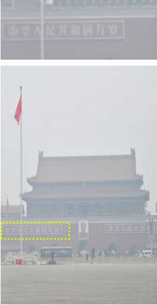
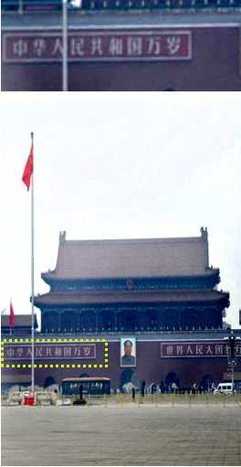

# DCPDN

## Densely Connected Pyramid Dehazing Network (CVPR'2018)
[He Zhang](https://sites.google.com/site/hezhangsprinter), [Vishal M. Patel](http://www.rci.rutgers.edu/~vmp93/)

[[Paper Link](https://arxiv.org/abs/1802.07412)] (CVPR'18)

We present a novel density-aware multi-stream densely connected convolutional neural
network-based algorithm, called DID-MDN, for joint rain density estimation and de-raining. The proposed method
enables the network itself to automatically determine the rain-density information and then efficiently remove the
corresponding rain-streaks guided by the estimated rain-density label. To better characterize rain-streaks with dif-
ferent scales and shapes, a multi-stream densely connected de-raining network is proposed which efficiently leverages
features from different scales. Furthermore, a new dataset containing images with rain-density labels is created and
used to train the proposed density-aware network. 

	@inproceedings{derain_zhang_2018,		
	  title={Density-aware Single Image De-raining using a Multi-stream Dense Network},
	  author={Zhang, He and Patel, Vishal M},
	  booktitle={CVPR},
	  year={2018}
	} 

         
         

## Prerequisites:
1. Linux
2. Python 2 or 3
3. CPU or NVIDIA GPU + CUDA CuDNN (CUDA 8.0)
 
## Installation:
1. Install PyTorch and dependencies from http://pytorch.org (Ubuntu+Python2.7)
   (conda install pytorch torchvision -c pytorch)

2. Install Torch vision from the source.
   (git clone https://github.com/pytorch/vision
   cd vision
   python setup.py install)

3. Install python package: 
   numpy, scipy, PIL, pdb
   
## Demo using pre-trained model
	python test.py --dataroot ./facades/github --valDataroot ./facades/github --netG ./pre_trained/netG_epoch_9.pth   
Pre-trained model can be downloaded at (put it in the folder 'pre_trained'): https://drive.google.com/drive/folders/1VRUkemynOwWH70bX9FXL4KMWa4s_PSg2?usp=sharing

Pre-trained density-aware model can be downloaded at (Put it in the folder 'classification'): https://drive.google.com/drive/folders/1-G86JTvv7o1iTyfB2YZAQTEHDtSlEUKk?usp=sharing

Pre-trained residule-aware model can be downloaded at (Put it in the folder 'residual_heavy'): https://drive.google.com/drive/folders/1bomrCJ66QVnh-WduLuGQhBC-aSWJxPmI?usp=sharing

## Training
	Training will be released soon.
## Testing
	python demo.py --dataroot ./your_dataroot --valDataroot ./your_dataroot --netG ./pre_trained/netG_epoch_9.pth   

## Dataset
Training and testing data will be released soon.

## Acknowledgments

Great thanks for the insight discussion with [Vishwanath Sindagi](http://www.vishwanathsindagi.com/) and initial discussion with [Dr. Zhou](https://sites.google.com/site/skevinzhou/home)
