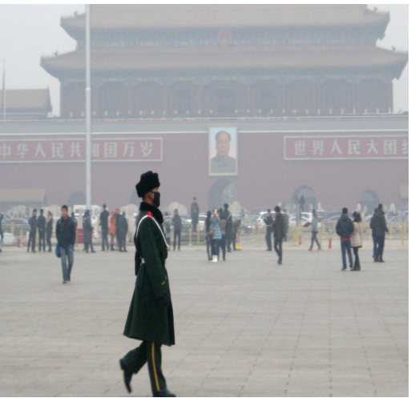
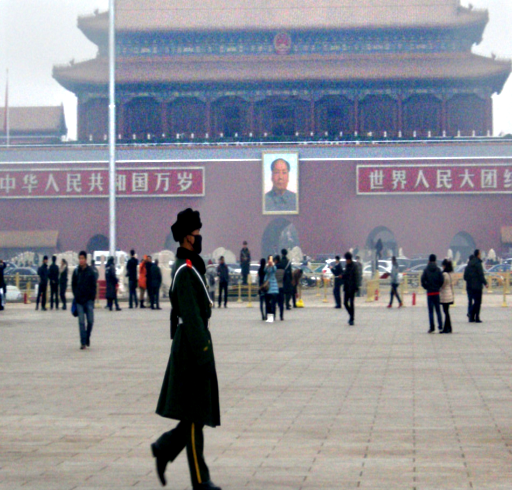

# DCPDN

## Densely Connected Pyramid Dehazing Network (CVPR'2018)
[He Zhang](https://sites.google.com/site/hezhangsprinter), [Vishal M. Patel](http://www.rci.rutgers.edu/~vmp93/)

[[Paper Link](https://arxiv.org/abs/1803.08396)] (CVPR'18)

We propose a new end-to-end single image dehazing method, called Densely Connected Pyramid Dehazing Network (DCPDN), which can jointly learn the transmission map, atmospheric light and dehazing all together. The end-to-end learning is achieved by directly embedding the atmospheric scattering model into the network, thereby ensuring that the proposed method strictly follows the physics-driven scattering model for dehazing. Inspired by the dense network that can maximize the information flow along features from different levels, we propose a new edge-preserving densely connected encoder-decoder structure with multi-level pyramid pooling module for estimating the transmission map. This network is optimized using a newly introduced edge-preserving loss function. To further incorporate the mutual structural information between the estimated transmission map and the dehazed result, we propose a joint-discriminator based on generative adversarial network framework to decide whether the
corresponding dehazed image and the estimated transmission map are real or fake. An ablation study is conducted to demonstrate the effectiveness of each module evaluated at both estimated transmission map and dehazed result. Extensive experiments demonstrate that the proposed method achieves significant improvements over the state-of-the-art methods.

	@inproceedings{dehaze_zhang_2018,		
	  title={Densely Connected Pyramid Dehazing Network},
	  author={Zhang, He and Patel, Vishal M},
	  booktitle={CVPR},
	  year={2018}
	} 

         

## Prerequisites:
1. Linux
2. Python 2 or 3
3. CPU or NVIDIA GPU + CUDA CuDNN (CUDA 8.0)
 
## Installation:
1. Install PyTorch and dependencies from http://pytorch.org (Ubuntu+Python2.7)
   (conda install pytorch torchvision -c pytorch)
Install pytorch 0.3.1 https://pytorch.org/previous-versions/
2. Install Torch vision from the source.
   
   	git clone https://github.com/pytorch/vision
	
   	cd vision
	
	python setup.py install

3. Install python package: 
   numpy, scipy, PIL, pdb
   
## Demo using pre-trained model
	python demo.py --dataroot ./facades/nat_new4 --valDataroot ./facades/nat_new4 --netG ./demo_model/netG_epoch_8.pth   
Pre-trained dehazing model can be downloaded at (put it in the folder 'demo_model'): https://drive.google.com/drive/folders/1BmNP5ZUWEFeGGEL1NsZSRbYPyjBQ7-nn?usp=sharing

Testing images (nature)  can be downloaded at (put it in the folder 'facades'):
https://drive.google.com/drive/folders/1q5bRQGgS8SFEGqMwrLlku4Ad-0Tn3va7?usp=sharing

Testing images (syn (Test A in the paper))  can be downloaded at (put it in the folder 'facades'):
https://drive.google.com/drive/folders/1hbwYCzoI3R3o2Gj_kfT6GHG7RmYEOA-P?usp=sharing

## Training (Fine-tuning)
	python train.py --dataroot ./facades/train512 --valDataroot ./facades/test512 --exp ./checkpoints_new --netG ./demo_model/netG_epoch_8.pth
More training details (especially how to repreduce the results using stage-wise training strategy) can be found in the paper. 

## Testing
	python demo.py --dataroot ./your_dataroot --valDataroot ./your_dataroot --netG ./pre_trained/netG_epoch_9.pth   

## Reproduce

To reproduce the quantitative results shown in the paper, please save both generated and target using python demo.py  into the .png format and then test using offline tool such as the PNSR and SSIM measurement in Python or Matlab.   In addition, please use netG.train() for testing since the batch for training is 1. 

## Dataset

Training images (syn)  can be downloaded at (put it in the folder 'facades'):
https://drive.google.com/drive/folders/1Qv7SIZBVAtb9G1d6iVKu_8rVSsXJdv26?usp=sharing

All the syn samples (both training and testing) are strored in Hdf5 file.
You can also generate your sample using 'create_train.py'
(Please download the NYU-depth @ http://horatio.cs.nyu.edu/mit/silberman/nyu_depth_v2/nyu_depth_v2_labeled.mat)

Following are the sample python codes how to read the Hdf5 file:
    
    file_name=self.root+'/'+str(index)+'.h5'
    f=h5py.File(file_name,'r')

    haze_image=f['haze'][:]
    gt_trans_map=f['trans'][:]
    gt_ato_map=f['ato'][:]
    GT=f['gt'][:]

Testing images (nature)  can be downloaded at (put it in the folder 'facades'):
https://drive.google.com/drive/folders/1q5bRQGgS8SFEGqMwrLlku4Ad-0Tn3va7?usp=sharing

Testing images (syn (Test A in the paper))  can be downloaded at (put it in the folder 'facades'):
https://drive.google.com/drive/folders/1hbwYCzoI3R3o2Gj_kfT6GHG7RmYEOA-P?usp=sharing

## How to creat your own testing samples
Since the proposed methods using hdf5 file to load the training samples, the generate_testsample.py help you to creat the testing or training sample yourself. 

## Extension
The proposed transmission net has demonstrated it effectiveness in multiple appplcaitions such as segmentation. crowd counting, face reconstruction from sparse sample and image synthesis. 

It has also been asked by other researchers and used for participating the [NTIRE-2018](http://www.vision.ee.ethz.ch/en/ntire18/) dehazing challenge and the proposed netowrk has demonstrated effectivenss from the performance in leaderboard. 

## Acknowledgments

Great thanks for the insight discussion with [Vishwanath Sindagi](http://www.vishwanathsindagi.com/) and initial discussion with [Dr. Kevin S. Zhou](https://sites.google.com/site/skevinzhou/home)

This work is under MIT license.
